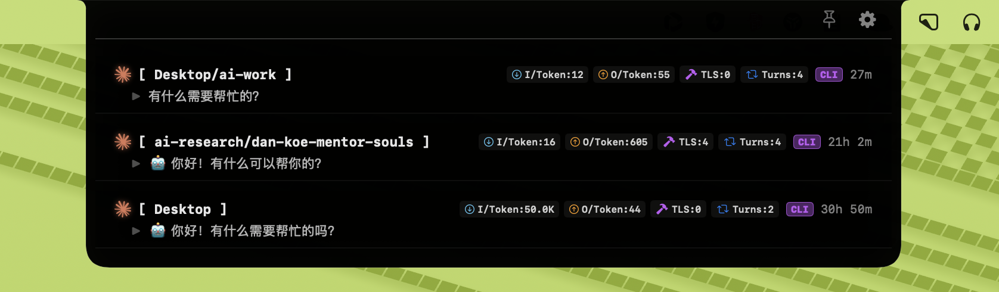
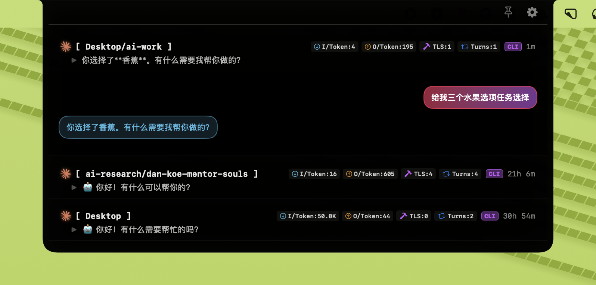
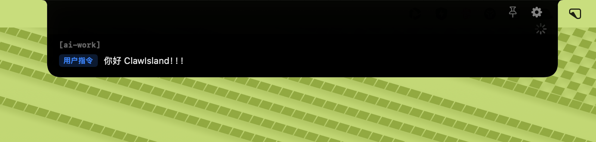
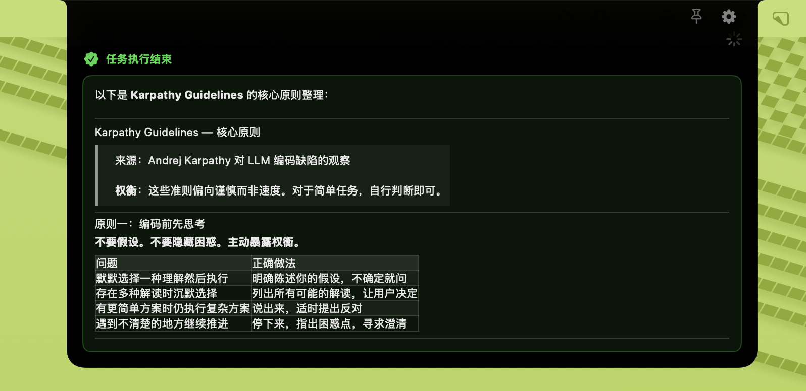
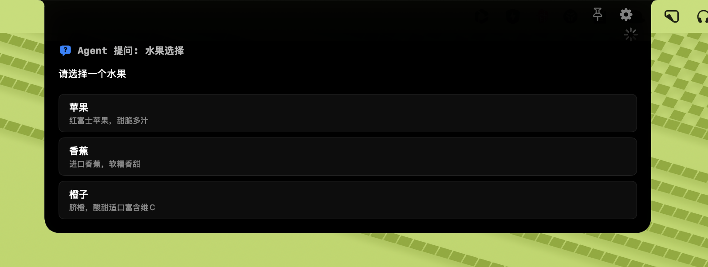
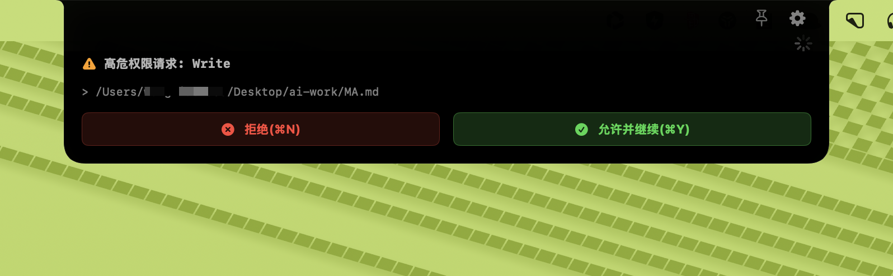

<h1 align="center">
  🐾 ClawIsLand
</h1>
<p align="center">
  <b>A Dynamic macOS Dynamic Island Status Panel Tailored for Claude Code</b><br>
  <a href="#installation">Installation</a> •
  <a href="#features">Features</a> •
  <a href="#build-from-source">Build</a><br>
  English | <a href="README.md">简体中文</a>
</p>

---

<p align="center">
  
</p>

## What is ClawIsLand?

**ClawIsLand** is a lightweight tool that resides in your MacBook's Dynamic Island or Notch area. It acts as a "transparent laboratory" for Claude Code.

When you are pair programming using the [Claude Code](https://docs.anthropic.com/en/docs/agents-and-tools/claude-code/overview) (CLI), you no longer need to constantly switch between your terminal tabs and IDE. Through underlying IPC process hooks, ClawIsLand captures Claude's execution stages in real-time (e.g., thinking, processing complete, waiting for authorization, throwing errors) and reports them directly at the top of your screen using vivid **pixel-art Mascots** and **immersive 8-bit sound effects**.

---

## ✨ Features

| Preview | Description |
| --- | --- |
|  | Chat List |
|  | Session Details (Markdown supported) |
|  | Message Notifications |
|  | Execution Results (Markdown supported) |
|  | AskQuestion Quick Select |
|  | Operation Authorization |


- **Native Dynamic Island UI** — Blends perfectly into the MacBook Notch/Dynamic Island. Smoothly expands when working and discreetly hides when idle, never hogging your screen real estate.
- **Optimized Purely for Claude Code** — Ditches bloated compatibility layers to focus entirely on Claude CLI's unique task models. Perfectly parses and intercepts key events like Permission Requests and conversational pauses.
- **Vivid Pixel Character Engine** — Not just a traffic light signal! Features a high-quality Canvas pixel rendering engine with over a dozen selectable mascot avatars (including `Clawd`, `Dex`, `Droid`, etc.). They will:
  - `Idle (.idle)`: Leisurely breathe and stand by.
  - `Processing (.processing)`: Sweat while typing furiously on the keyboard.
  - `Waiting for Approval (.waitingApproval)`: Jump back in shock and look around nervously.
- **Immersive Audio Feedback** — Deeply integrates a secure `NSDataAsset` audio engine within the App Sandbox, providing 8-bit retro arcade sound effects. (Supports independent ringtones for session start, task completion, errors, and manual approval requests).
- **Professional Settings Panel** — Polished with the native macOS `NavigationSplitView`. Allows you to drag sliders to adjust and preview your mascot's vitality in real-time right on the interface.
- **100% Native** — No Electron, no embedded web views. Developed purely with Swift + SwiftUI for an extremely lightweight and buttery smooth experience.

---

## 🚀 Installation & Usage

If you just want it out of the box, you can directly drop the packaged `.app` into your Applications folder and run it.

> **Tip:** Upon the first launch, if you encounter gatekeeper security restrictions, simply head to macOS **System Settings → Privacy & Security** and click **Open Anyway**.

### Hook Component Configuration
ClawIsLand works by lightly intercepting underlying JSON messages. Please run the built-in python installer or follow the system guide to ensure your global environment variables correctly source `clawisland-hook.py`.
*(More detailed deployment instructions will be added here later...)*

---

## 🛠️ Build from Source

This project is built on **macOS 14.0+** and Swift 5.9+. Thanks to Xcode 16's file-system-level automatic synchronization, you can directly clone and build the entire project seamlessly:

```bash
# 1. Clone the repository
git clone https://github.com/your-username/ClawIsLand.git
cd ClawIsLand

# 2. Fetch graphical dependencies like MarkdownUI: (Use if Xcode doesn't resolve packages automatically)
xcodebuild -resolvePackageDependencies -project ClawIsLand.xcodeproj -scheme ClawIsLand

# 3. Deploy and build!
./build_and_install.sh
```

---

## ⚙️ Personalization & Settings

Click the resident icon in the menu bar (or right-click it while the panel is active) to enter the Mascots' customization lab. Here you can:

1. **Appearance Preferences** — Play god and hire your exclusive resident mascot. You can even max out their twitchiness (supports up to 3.0× animation speed!).
2. **Sound Preferences** — Manage unnecessary distractions. For example, you can configure the system to only emit a long "beep" when Claude Code gets stuck and explicitly requests `bash` write permissions.
